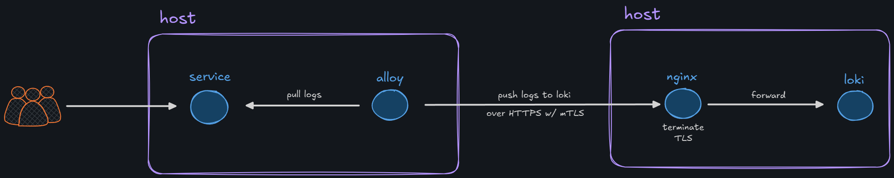

# grafana-alloy-loki



alloy components ([/config/config.alloy](/config/config.alloy)):
- container discovery w/ label filtering
- log capture (includes metadata like `container_id` and `service_name`)
- push log lines to loki over http (and mutual tls, for experimentation) 

## running with docker

navigate to root directory of this repo...

1. create the certs necessary for comms between alloy and nginx:

```bash
docker run --rm \
  --entrypoint sh \
  -v "$PWD/certs:/certs" \
  -v "$PWD/generate-certs.sh:/usr/local/bin/generate-certs.sh:ro" \
  alpine/openssl:latest -c /usr/local/bin/generate-certs.sh
```

2. start the stack:

```bash
docker compose up
```

## missing

`todo: add loki data source to grafana config`
